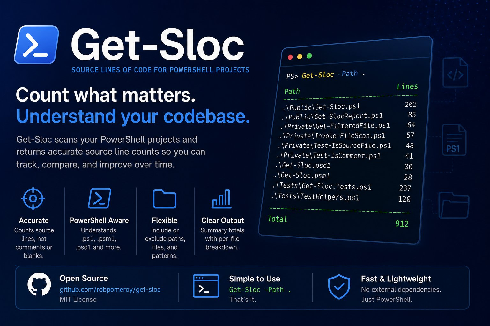

# Get-SLOC



Recursively counts source lines of code (SLOC) in PowerShell files (`.ps1`,
`.psm1`, `.psd1`).

Two implementations are provided:

- **`Get-SLOC.ps1`** — the original PowerShell script.
- **`Get-SLOC.Cli/`** — a C# command-line port with the same algorithm.

A line counts as SLOC if it is **non-blank** and is spanned by a
**non-comment token**. Comment-only lines and blank lines (including blank lines
inside here-strings) are excluded.

## Usage

### PowerShell script

```powershell
.\Get-SLOC.ps1 -Path C:\Some\Repo -ExcludeDirectories @(".venv", ".vscode", "docs", "logs", "Modules", "venv")
```

### C# CLI

```powershell
dotnet run --project Get-SLOC.Cli -- -Path C:\Some\Repo -ExcludeDirectories .venv .vscode docs logs Modules venv
```

Or run the built binary directly (see below).

## Building the C# CLI

### Prerequisites

- **.NET SDK 8.0 or later** — check with `dotnet --version`.
  - If you don't have it, install from <https://dotnet.microsoft.com/download>.
  - The project targets `net8.0`; a newer SDK (e.g. 10.x) builds it fine.

### Build (Release)

From the `Get-SLOC` directory:

```powershell
cd Get-SLOC.Cli
dotnet build -c Release
```

The first build downloads the `System.Management.Automation` NuGet package
automatically. If you see a NuGet "Cannot create a file when that file already
exists" error, clear the cache and retry:

```powershell
dotnet nuget locals http-cache --clear
dotnet restore --force
dotnet build -c Release
```

### Run the built binary

The build produces a framework-dependent DLL:

```powershell
dotnet .\Get-SLOC.Cli\bin\Release\net8.0\Get-SLOC.dll -Path C:\Some\Repo -ExcludeDirectories .venv .vscode docs logs Modules venv
```

To produce a **self-contained single executable** (no .NET runtime needed on
the target machine), publish with:

```powershell
dotnet publish -c Release -r win-x64 --self-contained true -p:PublishSingleFile=true
```

The executable is written to
`Get-SLOC.Cli\bin\Release\net8.0\win-x64\publish\Get-SLOC.exe`.

### Cleaning up build artefacts

Builds and publishes create `bin/`, `obj/`, and `publish/` folders under
`Get-SLOC.Cli/`. To remove them:

```powershell
# Remove build output (bin/ and obj/) for the current configuration
dotnet clean -c Release

# Remove ALL build artefacts, including publish output and obj/ caches
dotnet clean -c Release -o bin\Release\net8.0\win-x64\publish
Remove-Item -Recurse -Force .\Get-SLOC.Cli\bin, .\Get-SLOC.Cli\obj
```

`dotnet clean` removes compiled output but can leave `obj/` and `publish/`
folders behind, so the `Remove-Item` line is the reliable way to fully reset
the project to a clean state. These folders are regenerated on the next
`dotnet build` or `dotnet publish`.

## CLI options

| Option | Description |
| --- | --- |
| `-Path <path>` | File or directory to scan (default: current directory). A single file is counted directly; a directory is scanned recursively. |
| `-ExcludeDirectories <dir> [<dir> ...]` | Directory names to skip (case-insensitive). |
| `-h`, `--help` | Show help. |

## Performance

Measured against one of the author's projects (31 files, 3931 SLOC) on Windows:

| Implementation | Elapsed |
| --- | --- |
| PowerShell (original) | ~9.4 s |
| PowerShell (`File.ReadAllLines`) | ~8.2 s |
| C# CLI | ~4.2 s |

The C# port is roughly **2× faster** than the optimised PowerShell script. The
remaining cost in both is the shared native `Parser.ParseFile` tokeniser.

### Why the first run of the executable is slower

The self-contained single-file executable is slower on its **first** run, then
fast (~2 s) on every subsequent run. This is expected .NET behaviour, not a bug:

- **JIT compilation** — .NET compiles IL to native code at runtime. The first
  run compiles each method on demand; later runs reuse the OS-cached native
  code.
- **Single-file extraction** — `PublishSingleFile=true` bundles the assemblies
  (including the large `System.Management.Automation.dll`) into one file that
  is extracted to a temp directory on launch. The first run pays for that
  extraction plus a cold disk read; later runs hit the OS file cache.

The ~2 s warm-run figure is the one that matters for real use. If you want a
consistently fast cold start, the framework-dependent DLL
(`dotnet Get-SLOC.dll`) is lighter and starts faster, at the cost of requiring
the .NET runtime to be installed. AOT publishing (`-p:PublishAot=true`) can
eliminate first-run JIT, but `System.Management.Automation` relies heavily on
reflection and may not AOT/trim cleanly.
